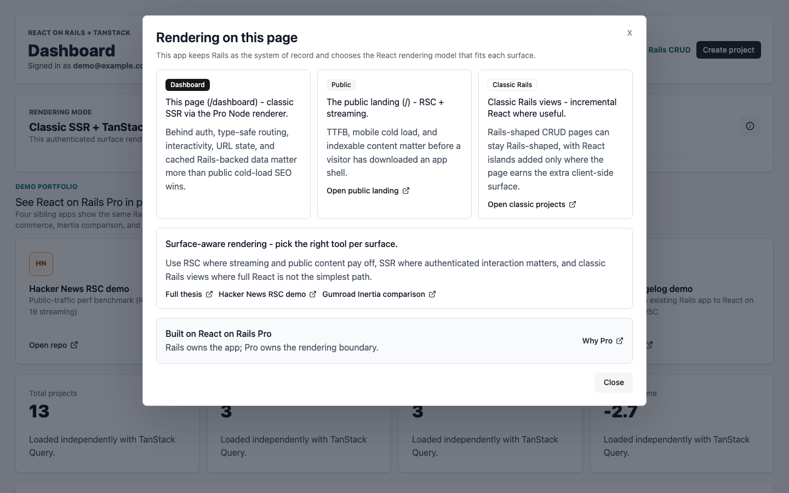

# React on Rails Starter TanStack

**React Server Components on Rails — without leaving Rails.**

Rails teams eyeing modern React in 2026 usually run into the same fork in the
road: keep classic Rails views, or migrate the React surface to Next.js. This
starter is the third option. Keep Rails as the application server — auth,
sessions, CSRF, validations, background jobs, mailers, and ActiveRecord — and
use [React on Rails Pro](https://reactonrails.com/pro/) for the React rendering
paths that need Node. You choose the right rendering model **per surface**
instead of moving the whole app to a JavaScript server framework.

**Live demo: [starter.reactonrails.com](https://starter.reactonrails.com)** —
sign in with `demo@example.com` / `password`.



## Why This Starter

Rails apps in 2026 already have Active Record models, sessions, mailers,
background jobs, admin workflows, and years of product behavior. The question
is not "Rails or React" in the abstract — it is whether you can add modern
React capabilities (RSC, streaming, type-safe routing, URL-owned table state,
client interactivity) without rebuilding the rest of the application around a
JavaScript server framework.

This starter's answer is **surface-aware rendering**: keep Rails at the center,
and pick the rendering model that fits each surface. Public, content-heavy
pages can use React Server Components and streaming. Authenticated app surfaces
can use classic React on Rails Pro SSR plus TanStack Router, Query, and Table.
Classic Rails CRUD still has a place and coexists in the same app.

The deeper argument is in [Why RSC on Rails](docs/08-why-rsc-on-rails.md), and
the head-to-head with Inertia is in
[React on Rails + TanStack vs Inertia](docs/02-vs-inertia.md).

## What It Shows

Each route demonstrates a deliberate rendering choice, not a fallback:

- **`/`** is the public landing page: the React Server Components + TanStack
  Router positioning, a map of every example surface linking to its source on
  GitHub, and copy-paste AI prompts for extending the starter with an agent. It
  shares the shadcn/Tailwind design system and dark mode with the rest of the
  app.
- **`/rsc-showcase`** is the public RSC + TanStack centerpiece. A bare TanStack
  Router loader fetches a React on Rails Pro RSC payload from Rails, decodes the
  Flight stream, and composes that server-streamed tree beside ordinary client
  React. It uses the Webpack bridge today; on the Rspack local default it renders
  the documented fallback until upstream Rspack RSC manifests land.
- **`/hello_server`** demonstrates streaming React Server Components. The demo
  keeps an interactive `LikeButton` client island inside a server-rendered
  tree. On the Webpack bridge the route renders end to end; under the strict
  production CSP the client island still waits on the upstream streaming nonce
  fix. See [SPIKE.md](SPIKE.md) and
  [RSC Streaming And CSP Nonces](docs/11-rsc-csp-nonce-spike.md).
- **`/dashboard`, `/settings...`, and `/projects...`** are Rails full-page
  routes that render the React on Rails Pro + TanStack Router, Query, and Table
  dashboard shell using classic SSR through the Node renderer.
- **TanStack Query** reads and mutates Rails JSON APIs, and **TanStack Table**
  drives the projects list with server-side filtering, sorting, pagination, and
  URL state.
- **`/classic/projects`** remains a classic Rails CRUD surface, showing a
  hybrid Rails UI coexisting with the TanStack surface.

The dashboard includes a rendering-mode drawer (pictured above) that explains,
in the product UI, why public RSC, authenticated SSR, TanStack state, and
classic Rails CRUD coexist in one app.

## Stack and Pinned Versions

Rspack remains the local default Shakapacker bundler. Use
`config/shakapacker.yml` and `config/rspack/` as the source of truth for the
default development path. Webpack is the deploy/RSC bridge, selected with
`SHAKAPACKER_ASSETS_BUNDLER=webpack` or the one-line Docker build ARG in
`.controlplane/Dockerfile`, until Rspack emits the RSC manifests the Pro RSC
client-reference path needs.

| Component | Version |
| --- | --- |
| React on Rails / Pro | `16.7.0.rc.3` |
| Shakapacker / Shakapacker Rspack | `10.1.0` |
| React | `19.0.6` |
| Rails | `8.1.x` |
| Language / tooling | TypeScript, pnpm |

Shakapacker stays on `10.1.0` for this release because public `11.1.0`
artifacts are not yet visible in the registries consumed by the starter.

## Setup

```sh
bin/setup
bin/dev
SHAKAPACKER_DEV_SERVER_HMR=true bin/dev --no-open-browser --route=dashboard
bin/dev static --no-open-browser --route=dashboard
bin/dev prod --no-open-browser --route=dashboard
```

`bin/dev` starts Rails, Rspack, Solid Queue, the React on Rails Pro Node
renderer, and the RSC bundle watcher. Development defaults to live reload; use
the HMR command only when testing HMR behavior.

Sign in with `demo@example.com` / `password`. Visit `/dashboard` for the
TanStack surface, `/projects` for a full-page load into the TanStack project
routes, `/classic/projects` for the Rails CRUD surface, `/rsc-showcase` for the
RSC-in-a-TanStack-route centerpiece, and `/hello_server` for the lower-level RSC
streaming demo.

## Checks

```sh
bundle exec rspec
pnpm run test:router-shim
pnpm test:playwright
pnpm run test:dev-modes
pnpm run test:hmr
pnpm run repro:rspack-rsc
bin/test
```

Release-impacting changes may also need:

```sh
bundle exec rails react_on_rails:doctor
pnpm peers check
bundle exec rubocop
pnpm audit --audit-level moderate
RAILS_ENV=production SECRET_KEY_BASE_DUMMY=1 REACT_ON_RAILS_STARTER_TANSTACK_DATABASE_PASSWORD=dummy bin/rails assets:precompile
```

Both static and production-assets development modes start the Node renderer
because the authenticated TanStack dashboard is server-rendered by React on
Rails Pro.

The authenticated `/dashboard` route is the TanStack surface.

TanStack Router runs under a Rails-owned HTML shell and is prerendered by React
on Rails Pro's Node renderer. Project index/create/show/edit and nested
settings routes stay inside the client-side dashboard experience, including
direct full-page loads to `/projects...`.

TanStack Router and Query devtools are bundled but disabled by default in
development. Enable them only when needed:

```js
localStorage.setItem("tanstack-devtools", "1")
```

## Current Status

This repo is the public template seed for the Rails + React on Rails Pro +
TanStack surface described in
[shakacode/react_on_rails#3364](https://github.com/shakacode/react_on_rails/pull/3364).
It includes Rails authentication, email verification, password reset, Projects
CRUD, scoped JSON APIs, demo seeds, development mail previews, and the
authenticated TanStack Router/Query/Table dashboard.

See [SPIKE.md](SPIKE.md) and the
[RSC Webpack Bundler Spike](docs/09-rsc-webpack-bundler-spike.md) for the
current RSC status. Rspack builds and server-only RSC bundling are green, but
interactive RSC client references are blocked until Rspack emits the React
Server Components client/server manifests expected by the Pro RSC path. The
Webpack bridge is verified for deploy and powers `/rsc-showcase`.

## Links

- [Why RSC on Rails](docs/08-why-rsc-on-rails.md) — the launch thesis.
- [React on Rails + TanStack vs Inertia](docs/02-vs-inertia.md) — the
  head-to-head comparison.
- [React on Rails Pro](https://reactonrails.com/pro/) — the commercial Node
  renderer, TanStack SSR, and RSC integration point.

## Docs

- [Architecture](docs/01-architecture.md)
- [React on Rails + TanStack vs Inertia](docs/02-vs-inertia.md)
- [Customizing](docs/03-customizing.md)
- [Deploying](docs/04-deploying.md)
- [Troubleshooting](docs/05-troubleshooting.md)
- [Tested Modes](docs/06-tested-modes.md)
- [Control Plane Handoff](docs/07-control-plane-handoff.md)
- [Why RSC on Rails](docs/08-why-rsc-on-rails.md)
- [RSC Webpack Bundler Spike](docs/09-rsc-webpack-bundler-spike.md)
- [RSC Payloads In A TanStack Route Loader](docs/10-rsc-tanstack-loader-spike.md)
- [RSC Streaming And CSP Nonces](docs/11-rsc-csp-nonce-spike.md)
- [Upgrading](UPGRADING.md)

## License

MIT
