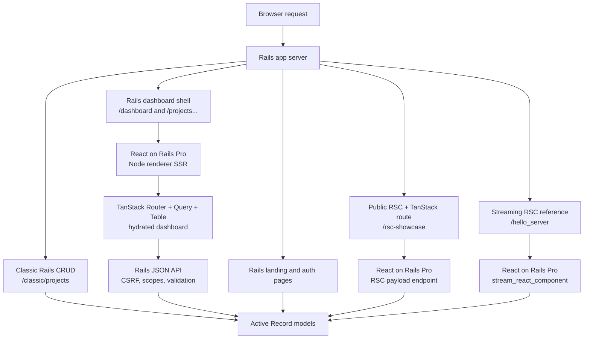

# Architecture

This starter begins from `create-react-on-rails-app --rsc --rspack` and currently targets the React on Rails Pro `17.0.0` final stack with React on Rails RSC `19.2.1` and Shakapacker `10.2.0`.

Shakapacker remains on `10.2.0` because the React on Rails 17 final upgrade did not require a coupled Shakapacker bump. Rspack is the checked-in local and deploy default. `react-on-rails-rsc@19.2.1` provides the Rspack RSC manifest support this starter needs, while Webpack remains an opt-in bridge/comparison path.

## Related React On Rails Docs

- [React on Rails documentation guide](https://reactonrails.com/docs/) for the
  canonical docs map.
- [15-minute quick start](https://reactonrails.com/docs/getting-started/quick-start/)
  for the baseline generator flow, including the `--rspack` option.
- [React on Rails Pro](https://reactonrails.com/docs/pro/) for the Node
  renderer, streaming SSR, RSC, and Pro feature map.
- [Render-functions and `railsContext`](https://reactonrails.com/docs/core-concepts/render-functions-and-railscontext/)
  for the Rails-to-React request context that this starter uses for SSR.
- [React server rendering](https://reactonrails.com/docs/core-concepts/react-server-rendering/)
  and [client vs. server rendering](https://reactonrails.com/docs/core-concepts/client-vs-server-rendering/)
  for the underlying `react_component(..., prerender: true)` contract.
- [React Server Components in React on Rails Pro](https://reactonrails.com/docs/pro/react-server-components/)
  and [Rspack compatibility](https://reactonrails.com/docs/pro/react-server-components/rspack-compatibility/)
  for the RSC/Rspack path used by `/rsc-showcase` and `/hello_server`.

## System Diagram

The diagram below shows ownership at a high level. The request, route,
rendering, and asset build handoffs are expanded in
[Architecture Flow Diagrams](14-architecture-flows.md).

- Rails owns the public routes, auth routes, API routes, and the HTML shells.
- Shakapacker uses Rspack for the default local client, server, and RSC bundles,
  including RSC client-reference manifest generation.
- The Webpack bridge uses `SHAKAPACKER_ASSETS_BUNDLER=webpack` and
  `config/webpack/` as an opt-in comparison path for the same RSC
  client-reference manifests.
- React on Rails Pro provides the Node renderer, TanStack SSR integration, and RSC streaming path.
- SolidQueue is installed by Rails and runs as a separate worker process in development and production.

## Authentication

Rails 8 authentication provides sessions, password reset, signup, and email verification. The verification lifecycle stores only a SHA-256 token digest, expires links after 24 hours, clears the digest after successful verification, and rotates the DB-backed session on success.

Rack::Attack limits verification email sends per IP and per email address. Development mail is available through `/letter_opener`.

## Projects

Projects are scoped to the verified current user. The default project URLs (`/projects`, `/projects/new`, `/projects/:id`, and `/projects/:id/edit`) render the TanStack dashboard shell, so refreshes and deep links stay in the React on Rails + TanStack experience. The classic Rails CRUD controller remains available under `/classic/projects` as the coexistence/reference path for server-side validations, inline errors, scoped lookup, and archive-on-destroy.

The JSON API under `/api/projects` supports status filtering, sorting, pagination, scoped show, create, update, and independent metrics for the dashboard cards.

## Authenticated Dashboard

`/dashboard` is a Rails route that renders `DashboardApp` through `react_component` with React on Rails Pro prerendering enabled. The Rails view keeps the HTML shell and no-JavaScript fallback, while TanStack Router owns the authenticated client-side surface after hydration. The dashboard route is an overview; `/projects` is the focused table and project-workspace route.

The dashboard uses:

- TanStack Router for `/dashboard`, `/projects`, `/settings/*`, `/projects/new`, `/projects/:id`, and `/projects/:id/edit` client routes.
- TanStack Query for Rails JSON API reads and mutations.
- TanStack Table for server-backed project filtering, sorting, pagination, and URL state.
- A CSRF-aware `apiFetch` helper for mutating JSON requests back to Rails.

The Node renderer receives Fetch API globals from `client/node-renderer.js` so TanStack Router can build and serialize its SSR state. ExecJS fallback rendering is disabled because TanStack SSR is async.

## RSC Showcase

`/rsc-showcase` is the public RSC + TanStack route. Rails serves the shell
through `RscShowcaseController#show`, and a bare TanStack Router loader in
`RscShowcaseApp` selects the React on Rails Pro server component and props.
The route is wrapped with `react-on-rails-pro/wrapServerComponentRenderer/client`
and renders the payload through the exported `RSCRoute` helper, so Pro owns the
length-prefixed stream parsing and Flight rendering while the route composes the
server-streamed RSC tree beside an ordinary client island.

This is intentionally not TanStack Start. The route keeps this starter on
Rails, React on Rails Pro, and bare `@tanstack/react-router`; it does not add
Vite, file-based routing, Hotwire, or Stimulus.

## Rspack Notes

Rspack is the active bundler in `config/shakapacker.yml`. Development disables client lazy compilation at the config top level and at `experiments.lazyCompilation`, uses live reload by default for this RC stack, and gates TanStack devtools behind `localStorage["tanstack-devtools"] = "1"` to avoid dev-server overlay requests from optional chunks. Explicit HMR mode enables React Fast Refresh through Shakapacker's Rspack wiring, while static and production-assets dev modes remain free of Rspack dev-server clients.

The public React Server Components path is green on the local Rspack default
with `react-on-rails-rsc@19.2.1`. The Rspack client, server, and
server-only RSC bundles compile and emit the React client/server manifests
expected by the React on Rails RSC client-reference path. The Webpack bridge
remains documented in [RSC Webpack Bundler Spike](09-rsc-webpack-bundler-spike.md)
as an opt-in bridge and historical comparison path.
