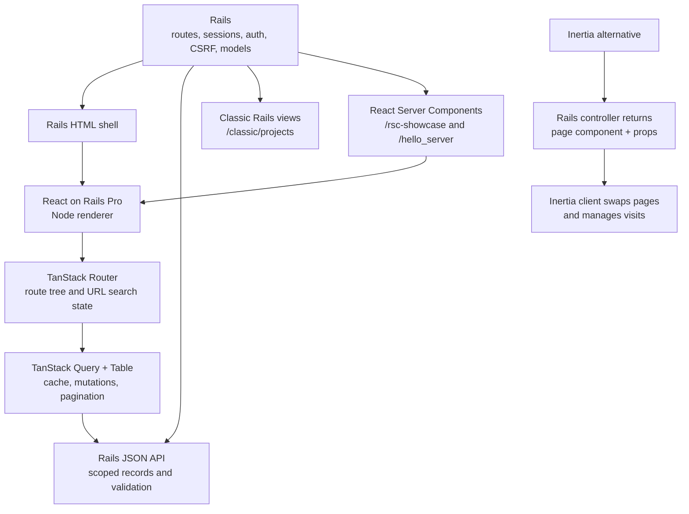
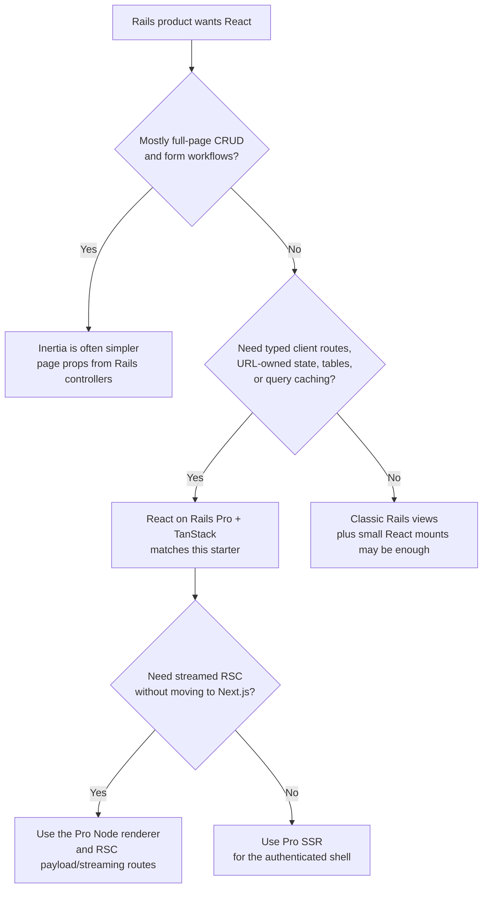

# React on Rails + TanStack vs Inertia

This starter is not "Inertia with more libraries." The structural difference is
who owns routing and where the rendering boundary lives.

Inertia lets Rails controllers return JavaScript page components and props. It
keeps the application close to classic server routing while replacing ERB with
React, Vue, or Svelte pages. That is a good shape for many Rails apps.

This starter keeps Rails as the application server, but it does not make Rails
page props the only frontend contract. Rails still owns sessions,
authentication, authorization, CSRF, validations, mail, jobs, and persistence.
React on Rails Pro owns the server-side React rendering boundary. TanStack
Router, Query, and Table own the authenticated dashboard interaction model. The
RSC routes are separate because RSC is a different rendering model, not a richer
page-props protocol.

The tradeoff is real. Inertia is simpler when the product is mostly full-page
CRUD. React on Rails Pro plus TanStack is more explicit when the product needs
typed client routes, URL-owned state, server-backed tables, query caching,
classic Rails coexistence, and a path to React Server Components without moving
the app to Next.js.

## Related React On Rails Docs

- [Documentation guide](https://reactonrails.com/docs/) for the canonical React
  on Rails docs map and alternatives-oriented entry points.
- [React on Rails Pro](https://reactonrails.com/docs/pro/) for why Pro is the
  rendering tier used when Rails needs Node-rendered React, streaming SSR, and
  RSC.
- [Render-functions and `railsContext`](https://reactonrails.com/docs/core-concepts/render-functions-and-railscontext/)
  for the request-context handoff that differs from Inertia's page-props
  protocol.
- [React server rendering](https://reactonrails.com/docs/core-concepts/react-server-rendering/)
  and [client vs. server rendering](https://reactonrails.com/docs/core-concepts/client-vs-server-rendering/)
  for the SSR baseline behind the authenticated TanStack shell.
- [Using React Router](https://reactonrails.com/docs/building-features/react-router/)
  for the React on Rails router guidance; this starter uses TanStack Router for
  the first-class SSR/dehydration path.
- [React Server Components in React on Rails Pro](https://reactonrails.com/docs/pro/react-server-components/),
  [RSC rendering flow](https://reactonrails.com/docs/pro/react-server-components/rendering-flow/),
  and [Rspack compatibility](https://reactonrails.com/docs/pro/react-server-components/rspack-compatibility/)
  for the RSC boundary that Inertia does not provide.

## Ownership Diagram

## Decision Diagram

## Inertia Owns Its Routing Model - TanStack Cannot Be A Peer

Inertia routes are still Rails routes, but Inertia owns the browser visit model.
Its Rails docs describe the pattern directly: the first request returns an HTML
shell with a page object, then later Inertia visits use XHR and receive JSON
containing the page component name, props, URL, and version. The client swaps in
the new page component and updates browser history.

That is not a criticism. It is the point of Inertia. You keep controllers,
routes, middleware, sessions, and redirects, and you avoid building a separate
REST or GraphQL API for the web UI. The client does not need an application
router in the same sense because Inertia is already coordinating visits, page
components, page props, and history.

TanStack Router is a different primitive. It owns a client route tree, route
matching, params, typed search state, links, preloading APIs, loader APIs, and
SSR state handoff. In this starter, Rails maps `/dashboard`, `/projects...`,
and `/settings...` to [`DashboardController#show`](../app/controllers/dashboard_controller.rb).
The controller passes the initial path and query string to the React shell, and
[`DashboardApp`](../app/javascript/src/Dashboard/ror_components/DashboardApp.tsx)
uses those values to hydrate the TanStack Router route tree.

Putting TanStack Router on top of Inertia would create two owners for the same
job. Inertia would be responsible for page visits and component swaps, while
TanStack Router would be responsible for route matching, search state, and
navigation semantics inside the same surface. You can mount local React
components inside an Inertia page, but making TanStack Router a peer routing
system fights the abstraction that makes Inertia useful.

This repo demonstrates both sides deliberately. The authenticated dashboard uses
TanStack Router routes, URL search validation, SSR handoff, and router links,
while dashboard data fetching stays in TanStack Query so the Rails JSON API,
CSRF handling, cache keys, invalidation, and table state remain visible.
`/rsc-showcase` demonstrates the other primitive: a bare TanStack Router loader
selects the React on Rails Pro server component and props, then the exported
`RSCRoute` helper fetches and composes that streamed tree inside the route.

## RSC Requires A Rendering Boundary Inertia Does Not Have

Inertia SSR is not React Server Components. Inertia Rails supports optional SSR
with a JavaScript renderer, and that is useful for first paint and SEO. The
transport is still the Inertia page object: a component name plus props for a
page tree that belongs to the client application.

RSC is different. A server component renders on the server and streams a
serialized React component payload. Client components appear only at explicit
boundaries, usually marked with `'use client'`, and only those client islands
ship browser JavaScript. The server is not merely preparing props for the
browser. It is rendering part of the component tree and sending React a mixed
server/client tree to continue.

This starter demonstrates that boundary in two ways. `/hello_server` is the
low-level streaming reference: Rails routes the request to
[`HelloServerController`](../app/controllers/hello_server_controller.rb), the
view calls [`stream_react_component`](../app/views/hello_server/index.html.erb),
and the RSC source separates the async server component from the interactive
[`LikeButton`](../app/javascript/src/HelloServer/components/LikeButton.tsx)
client island. `/rsc-showcase` is the product-facing bridge: the TanStack route
selects the React on Rails Pro server component and `RSCRoute` renders the RSC
payload beside normal client React.

That distinction is why "Inertia adds RSC" is not a small feature request. It
would need a rendering boundary that understands the RSC payload and the
server/client module manifests, not just JSON page props. If Inertia ever wants
that shape in Rails, the natural integration would be Inertia on top of a
renderer such as React on Rails Pro. That is an architectural inference, not a
claim about Inertia's roadmap.

The Rspack status is also intentionally conservative. Rspack remains the local
and deploy default, and `react-on-rails-rsc@19.0.5-rc.3` emits the RSC
client-reference manifests required by React on Rails Pro. The status is tracked
in [SPIKE.md](../SPIKE.md) and [Tested Modes](06-tested-modes.md). The Webpack
bridge remains an opt-in comparison path.

## TanStack Router RSC Is Not TanStack Start Parity

TanStack's framework-level RSC story lives in TanStack Start, which is a Vite
framework with its own conventions and experimental RSC support. This starter
does not use TanStack Start, Vite, or file-based routing.

The honest claim here is narrower: React on Rails Pro composes server-streamed
RSC into a bare TanStack Router route on Rails. That is enough to demonstrate
the architectural gap with Inertia, because Inertia's page-props transport has
no place to host a streamed RSC payload and its client/server module manifests.

## What Inertia Is Better At

Inertia is often the better answer for a CRUD-oriented Rails product.

- It has a smaller mental model. A Rails controller returns a page component and
  props; the client renders that page.
- It avoids a separate web API for the frontend. Rails actions can pass data
  straight to components.
- It works naturally with Rails sessions, redirects, validation errors, shared
  props, and existing controller conventions.
- It supports optional SSR, partial reloads, deferred props, forms, testing
  helpers, and mature Rails adapter documentation.
- The official React starter kit from the Inertia Rails ecosystem already ships
  Rails, React, TypeScript, shadcn/ui, authentication, Kamal, Vite, and optional
  SSR.

If your team wants React pages in a Rails monolith and does not need a separate
client routing primitive, RSC, or explicit URL-owned table/query state, Inertia
is a pragmatic choice.

## What This Starter Ships That Inertia Kits Do Not

This is not a claim that Inertia cannot add adjacent libraries. It is a claim
that this starter is arranged around different ownership boundaries.

| Surface | What to inspect |
| --- | --- |
| Rails-owned full-page entrypoints into TanStack routes | [`config/routes.rb`](../config/routes.rb) maps `/dashboard`, `/projects...`, and `/settings...` to the dashboard shell instead of classic CRUD pages. [`DashboardController`](../app/controllers/dashboard_controller.rb) passes the initial path, search string, current user, links, and API endpoints. |
| React on Rails Pro SSR for the dashboard | [`app/views/dashboard/show.html.erb`](../app/views/dashboard/show.html.erb) prerenders `DashboardApp`, and [`DashboardApp.tsx`](../app/javascript/src/Dashboard/ror_components/DashboardApp.tsx) uses `serverRenderTanStackAppAsync` for the server branch. |
| TanStack Router route tree and URL state | [`DashboardApp.tsx`](../app/javascript/src/Dashboard/ror_components/DashboardApp.tsx) defines the authenticated route tree, validates project-table search params, uses router links, and preserves direct full-page loads into `/projects...`. |
| TanStack Router route composing RSC | [`RscShowcaseApp.tsx`](../app/javascript/src/RscShowcase/ror_components/RscShowcaseApp.tsx) defines the public `/rsc-showcase` route whose loader selects a React on Rails Pro server component/props pair and whose `RSCRoute` render composes the payload with a client island. |
| TanStack Query with Rails CSRF | [`apiFetch`](../app/javascript/lib/apiFetch.ts) sends same-origin credentials and the Rails CSRF token. [`queryClient`](../app/javascript/lib/queryClient.ts) centralizes query defaults. Dashboard mutations invalidate Rails-backed query keys. |
| TanStack Table backed by Rails persistence | `ProjectsTable` in [`DashboardApp.tsx`](../app/javascript/src/Dashboard/ror_components/DashboardApp.tsx) keeps filter, sort, and pagination state in the URL. [`Api::ProjectsController`](../app/controllers/api/projects_controller.rb) owns filtering, sorting, pagination, validation errors, and per-user scoping. |
| Classic Rails CRUD coexistence | The [`classic` routes](../config/routes.rb) and [`ProjectsController`](../app/controllers/projects_controller.rb) keep a Rails-rendered CRUD surface at `/classic/projects`, while `/projects...` stays in the TanStack dashboard. |
| RSC streaming reference route | [`HelloServerController`](../app/controllers/hello_server_controller.rb), [`hello_server/index.html.erb`](../app/views/hello_server/index.html.erb), and [`HelloServer`](../app/javascript/src/HelloServer/components/HelloServer.tsx) demonstrate the lower-level RSC streaming route. |
| Rendering-mode explanation in the product UI | `RenderingModeDrawer` in [`DashboardApp.tsx`](../app/javascript/src/Dashboard/ror_components/DashboardApp.tsx) explains why public RSC, authenticated SSR, TanStack state, and classic Rails CRUD coexist in one app. |
| Head-to-head and migration demos | The [Gumroad-style RSC comparison](https://github.com/shakacode/react-on-rails-demo-gumroad-rsc) is the head-to-head demo. The [Octochangelog migration probe](https://github.com/shakacode/react_on_rails-demo-octochangelog-on-rails-pro) is the migration story. |

The deeper RSC thesis is in [Why RSC On Rails](08-why-rsc-on-rails.md).
That document also keeps the current public routes honest: `/` is the Rails
landing page, `/rsc-showcase` is the RSC + TanStack centerpiece on Rspack, and
`/hello_server` is the lower-level streaming reference route.

## When To Pick Inertia Anyway

Pick Inertia when the product shape matches Inertia's strengths.

- The app is mostly full-page CRUD and form workflows.
- Rails controllers returning page props are easier for the team to reason
  about than a separate client route tree.
- You do not need RSC, or you are comfortable treating SSR as prerendered page
  components rather than streamed server components.
- You do not need TanStack Router to own typed route/search state.
- You do not need TanStack Query cache invalidation and server-backed table
  state to be first-class reference patterns.
- You want fewer moving parts more than you want explicit rendering-mode
  boundaries.

That is a respectable trade. A Rails team should not adopt this starter just
because it has more technology in it. The extra structure is justified only
when the app needs the routing, data, table, SSR, RSC, or hybrid Rails UI
boundaries that the simpler model intentionally hides.

## Why Not Next.js

Next.js is the default answer for many React teams because it owns the
JavaScript server, the App Router, RSC, client/server component boundaries, and
deployment conventions. If the product is greenfield, the team is JavaScript
first, and there is no Rails-shaped domain model to preserve, Next.js may be
the right call.

For an existing Rails product, the cost is that Rails stops being the center of
gravity. You now have a second server runtime for the React app, a boundary
between that runtime and Active Record, and another place to model sessions,
authorization, caching, error handling, observability, deployment, and
background job behavior. Over time Rails often becomes an API service behind
the React server, even if the valuable product logic still lives in Rails.

React on Rails Pro is the other shape. Rails keeps the request, session,
current user, CSRF token, routes, models, mailers, jobs, validations, and
operational story. The Pro Node renderer handles React rendering work that
needs Node: classic SSR, TanStack SSR handoff, and the RSC streaming path. That
is why this starter is hybrid by design. It is not trying to make Rails look
like Next.js; it is trying to let a Rails app choose modern React surfaces
without turning Rails into a backend-only service.

## References

- [Inertia Rails guide](https://inertia-rails.dev/guide)
- [Inertia Rails: How it works](https://inertia-rails.dev/guide/how-it-works)
- [Inertia Rails: The protocol](https://inertia-rails.dev/guide/the-protocol)
- [Inertia Rails React Starter Kit](https://github.com/inertia-rails/react-starter-kit)
- [TanStack Router overview](https://tanstack.com/router/router/docs)
- [TanStack Router data loading](https://tanstack.com/router/latest/docs/framework/react/guide/data-loading)
- [TanStack Router preloading](https://tanstack.com/router/latest/docs/framework/react/guide/preloading)
- [React on Rails documentation guide](https://reactonrails.com/docs/)
- [React on Rails Pro](https://reactonrails.com/docs/pro/)
- [Render-functions and `railsContext`](https://reactonrails.com/docs/core-concepts/render-functions-and-railscontext/)
- [React server rendering](https://reactonrails.com/docs/core-concepts/react-server-rendering/)
- [React Server Components in React on Rails Pro](https://reactonrails.com/docs/pro/react-server-components/)
- [React Server Components rendering flow](https://reactonrails.com/docs/pro/react-server-components/rendering-flow/)
- [Rspack compatibility with React Server Components](https://reactonrails.com/docs/pro/react-server-components/rspack-compatibility/)
- [React Server Components](https://react.dev/reference/rsc/server-components)
- [React `use client`](https://react.dev/reference/rsc/use-client)
- [Next.js Server and Client Components](https://nextjs.org/docs/app/getting-started/server-and-client-components)
