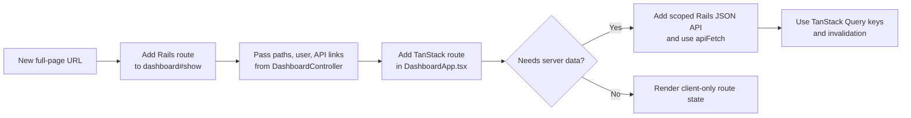
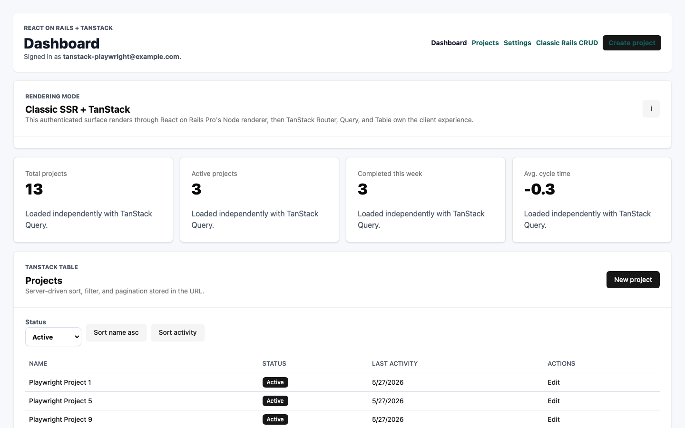

# Customizing

## Related React On Rails Docs

- [15-minute quick start](https://reactonrails.com/docs/getting-started/quick-start/)
  for the generator defaults this starter extends.
- [Render-functions and `railsContext`](https://reactonrails.com/docs/core-concepts/render-functions-and-railscontext/)
  for passing Rails-owned request context into React render functions.
- [Using React Router](https://reactonrails.com/docs/building-features/react-router/)
  for router guidance and why TanStack Router is the SSR-oriented choice here.
- [React on Rails Pro installation](https://reactonrails.com/docs/pro/installation/)
  for the Pro imports and Node renderer setup behind this starter.

## Route Extension Diagram



## Rename The App

Update the Rails module name in `config/application.rb`, database names in `config/database.yml`, and package metadata in `package.json`.

## Change Development Ports

Copy `.env.example` to `.env`, then change `PORT`, `SHAKAPACKER_DEV_SERVER_PORT`, or `RENDERER_PORT`.

## Add UI Packages

Use pnpm for JavaScript dependencies:

```sh
pnpm add package-name
```

Tailwind v4 is wired through `app/javascript/src/styles/tailwind.css` and
`postcss.config.mjs`. The CSS entry uses explicit `@source` paths so Rspack
watch mode does not loop on generated build output.

The shadcn/ui scaffold is initialized in `components.json`. Use Bun only for
shadcn/ui component generation:

```sh
bunx shadcn add card button input
```

Shared primitives live in `app/javascript/src/components/ui`, and shared
component helpers live in `app/javascript/src/lib`.

The authenticated TanStack dashboard in
`app/javascript/src/Dashboard/ror_components/DashboardApp.tsx` is the reference
consumer for these primitives. It uses shadcn `Card`, `Table`, `Button`, `Input`,
`Label`, `Dialog`, `Badge`, `Alert`, and `Sonner` components while keeping Rails
as the owner of persistence, authentication, and API responses.

Classic Rails auth and `/classic/projects` views intentionally keep the
`auth-*` CSS conventions so the starter demonstrates a hybrid Rails UI
coexisting with the TanStack dashboard.



## Extend Dashboard Routes

Add new authenticated client routes in `app/javascript/src/Dashboard/ror_components/DashboardApp.tsx`, then back them with scoped Rails JSON endpoints under `/api/*` when they need server data. Reuse `apiFetch` for mutations so Rails CSRF protection remains active.

Keep Rails as the owner of top-level shell routes. If a new URL should load directly from the browser, add a Rails route to `dashboard#show` and a matching TanStack route.

The starter uses this pattern for project URLs: `/projects...` loads the TanStack shell, while `/classic/projects...` keeps the optional Rails CRUD UI available as a hybrid reference path.
