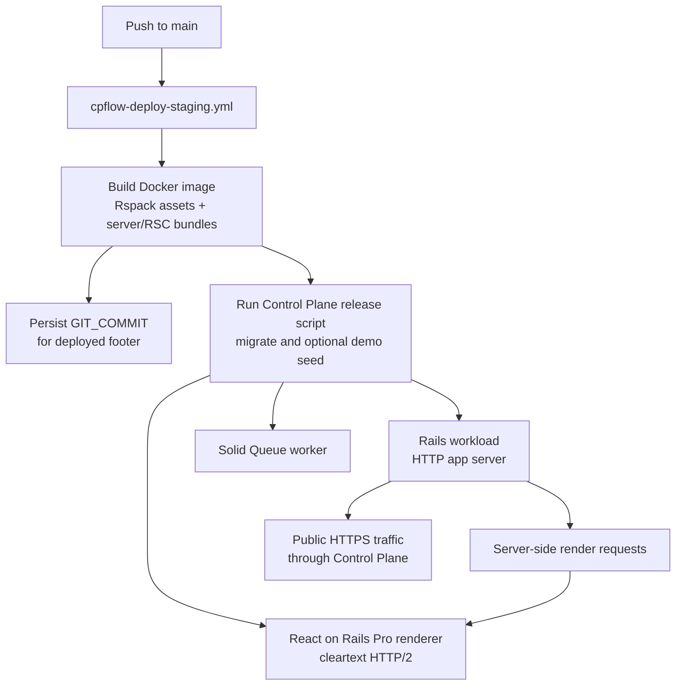

# Deploying

## Related React On Rails Docs

- [React on Rails Pro](https://reactonrails.com/docs/pro/) for the Pro feature
  map and production license expectations.
- [React on Rails Pro installation](https://reactonrails.com/docs/pro/installation/)
  for the Node renderer package and runtime setup.
- [Streaming SSR](https://reactonrails.com/docs/pro/streaming-ssr/) for the
  renderer behavior that makes a separate Node workload necessary.
- [Pro troubleshooting](https://reactonrails.com/docs/pro/troubleshooting/) for
  renderer, license, cache, and RSC payload deployment failures.

## Deployment Diagram



Production needs three process types:

```Procfile
web: bundle exec thrust bundle exec rails server -p ${PORT:-3000}
worker: bin/jobs
renderer: RAILS_ENV=${RAILS_ENV:-production} RENDERER_PORT=${RENDERER_PORT:-3800} node client/node-renderer.js
```

Set these environment variables in your host:

- `RAILS_MASTER_KEY`
- `DATABASE_URL`
- `RENDERER_PORT`
- mail provider credentials
- `SENTRY_DSN` if Sentry is enabled

The Node renderer speaks cleartext HTTP/2. In Control Plane, expose the renderer
workload port as `http2`, not `http`, otherwise SSR requests can fail with proxy
protocol errors. The renderer binds to `0.0.0.0` automatically when
`RAILS_ENV=production` so Control Plane and other container platforms can route
to it. Local development keeps the safer `localhost` binding. Override
`RENDERER_HOST` only if your hosting platform requires a different bind address.

Rails production config forces SSL and assumes traffic reaches Rails through a
trusted TLS-terminating reverse proxy. Keep public HTTP-to-HTTPS redirects or
blocking at that proxy/load balancer instead of exposing cleartext Rails traffic
directly.

Before deploying, run:

```sh
RAILS_ENV=production SECRET_KEY_BASE_DUMMY=1 bin/rails assets:precompile
```

For a local production-like smoke test, run:

```sh
bin/dev prod --no-open-browser --route=dashboard
```

This precompiles optimized bundles and starts Rails plus the Node renderer on local development data.

For the full build/run matrix, including static assets, HMR, and the current Rspack/RSC repro fixture, see [Tested Modes](06-tested-modes.md).

Do not run development seeds in normal production environments. For an
intentional public demo app, set `ALLOW_DEMO_SEED=true` and run
`bin/rails db:seed` once after migrations; the Control Plane release script does
that automatically when the flag is present. Leave the flag unset for private
staging and real production apps. This template keeps `config/master.key` out of
git; generate and store production secrets in your deployment environment.

## Control Plane

Control Plane support lives under `.controlplane/` and is generated by
`cpflow`. The generated GitHub Actions flow creates review apps with
`+review-app-deploy`, deploys staging from `main`, and promotes staging to
production manually.

The Control Plane setup runs separate workloads for Rails, Solid Queue, and the
React on Rails Pro Node renderer. See `.controlplane/readme.md` for required
GitHub variables, Control Plane secrets, and the release-tag pinning workflow.

The cpflow build passes the deployed GitHub revision to Docker as `GIT_COMMIT`.
`.controlplane/Dockerfile` persists that value into the runtime environment so
the shared Rails footer and authenticated TanStack footer can link to the exact
commit running in the deployed image.
