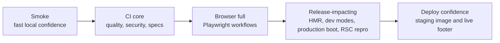

# Tested Modes

This starter keeps the TanStack dashboard on Rspack and the launch RC stack:
React on Rails Pro `17.0.0-rc.0` with Shakapacker `10.1.0`.
Shakapacker is intentionally not documented as `11.1.0` because public
`11.1.0` artifacts are not visible in the registries consumed by the starter.
Rspack is the default local and deploy bundler in the checked-in matrix.
Webpack has explicit opt-in bridge/comparison smokes below.

## Related React On Rails Docs

- [React server rendering](https://reactonrails.com/docs/core-concepts/react-server-rendering/)
  for the SSR contract covered by the test matrix.
- [React on Rails Pro](https://reactonrails.com/docs/pro/) for the Node
  renderer, streaming, RSC, and Pro troubleshooting map.
- [React Server Components in React on Rails Pro](https://reactonrails.com/docs/pro/react-server-components/)
  and [RSC rendering flow](https://reactonrails.com/docs/pro/react-server-components/rendering-flow/)
  for the bundle and payload paths covered by the RSC smokes.
- [Rspack compatibility](https://reactonrails.com/docs/pro/react-server-components/rspack-compatibility/)
  for the default bundler path this matrix protects.

## Test Tier Diagram

The tables below track the local and CI coverage expected before changing
build, rendering, or routing behavior.

## Entrypoints

| Tier | Command | Coverage | When to use |
| --- | --- | --- | --- |
| Smoke | `bin/test smoke` | React on Rails doctor, TypeScript, router shim, RSpec, and the Playwright health smoke. | Fast local pre-push check. |
| CI core | `bin/ci` or `bin/test ci` | RuboCop, peer checks, Ruby/JS security audits, smoke tier. | Default CI core job and local confidence before opening a PR. |
| Full | `bin/test all` | Quality checks, smoke tier, and the full Playwright browser suite. | Browser-facing app changes and dashboard data-flow changes. |
| Release-impacting | `bin/test release` | Full tier plus security checks, dev-mode, HMR, production boot smoke, and Rspack/RSC repro checks. | Build, rendering, routing, Rspack, React on Rails Pro, or Node renderer changes. This is intentionally slower than the default tier. |

## Coverage Matrix

| Mode | Command | Coverage | Expected result |
| --- | --- | --- | --- |
| React on Rails doctor | `bin/test doctor` or `bundle exec rails react_on_rails:doctor` | CI core | Verifies the Rails/Rspack/React on Rails configuration, including Pro SSR paths. |
| Quality checks | `bin/test quality` | CI core | Runs RuboCop and package peer-dependency validation. |
| Security checks | `bin/test security` | CI core | Runs bundler-audit, Brakeman, and pnpm audit. |
| Router shim | `bin/test router-shim` or `pnpm run test:router-shim` | CI core | Verifies the TanStack Router compatibility shim maps Pro's expected `router.__store.setState` API onto the current `router.stores` shape. |
| Rails specs | `bin/test rspec [args...]` or `bundle exec rspec` | CI core | Runs model, request, and system specs, including authenticated project and verification flows. Extra arguments are forwarded to RSpec for focused runs. |
| Playwright smoke | `bin/test playwright-smoke [args...]` | CI core | Boots Rails and the React on Rails Pro Node renderer in `RAILS_ENV=test`, then checks the `/up` browser smoke. Extra arguments are forwarded to Playwright. This is not a substitute for the dashboard suite. |
| Playwright full | `bin/test playwright [args...]` or `pnpm test:playwright` | CI | Builds test packs with Rspack, boots Rails and the React on Rails Pro Node renderer in `RAILS_ENV=test`, and exercises dashboard hydration, direct `/projects...` loads, client navigation, profile update, project create/edit flows, public and authenticated route screenshots, and the RSC showcase payload route. Extra arguments are forwarded to Playwright for focused runs. |
| Accessibility smoke | `bin/test a11y` | Focused browser accessibility smoke | Runs Playwright tests tagged `@a11y` for public-page landmarks and named links, classic Rails auth labels/live errors, and authenticated dashboard navigation, settings tabs, and dialog focus behavior. |
| Visual route screenshots | `pnpm exec playwright test test/playwright/visual_routes.spec.ts` | Focused browser visual coverage | Captures first-viewport visual snapshots for the public landing, RSC showcase, auth forms, and authenticated TanStack dashboard routes with deterministic test data. Use `--update-snapshots` intentionally when accepting a route layout change. |
| Live reload dev | `bin/test dev-modes` or `node script/dev-mode-smoke.mjs dev` | CI | Boots Rails, Rspack dev server, SolidQueue, Node renderer, server bundle watcher, and RSC bundle watcher. The default config uses `hmr: false` and `live_reload: true`, and the smoke verifies that a browser-open source edit is observed. |
| Static assets dev | `bin/test dev-modes` or `node script/dev-mode-smoke.mjs static` | CI | Runs `bin/dev static`, starts Rails, Rspack watch mode, SolidQueue, and the Node renderer, then logs in and checks `/dashboard`, client navigation, and direct `/projects/new`. The browser smoke fails if static mode requests or receives Rspack dev-server clients, hot-update files, overlay code, or disabled TanStack devtools chunks. |
| Production-assets dev | `bin/test dev-modes` or `node script/dev-mode-smoke.mjs prod` | CI | Runs `bin/dev prod`, precompiles optimized Rspack bundles, starts Rails, SolidQueue, and the Node renderer, then checks the same authenticated TanStack routes. The browser smoke uses the same negative asset assertions as static mode. |
| HMR dev | `bin/test hmr` or `SHAKAPACKER_DEV_SERVER_HMR=true bin/dev --no-open-browser --route=dashboard` | CI | Boots the same default dev stack with `hmr: true`, `live_reload: false`, and React Fast Refresh enabled by Shakapacker's Rspack integration, then verifies the authenticated TanStack routes hydrate, navigate, and observe a browser-open source edit. This smoke does not assert state-preserving React Fast Refresh updates. |
| Webpack HMR bridge | `bin/test webpack-hmr` or `SHAKAPACKER_ASSETS_BUNDLER=webpack node script/dev-mode-smoke.mjs hmr` | Webpack bridge sentinel | Boots Rails, Webpack dev-server, SolidQueue, the Node renderer, and the server/RSC bundle watchers with HMR enabled, then verifies the authenticated TanStack routes hydrate, navigate, and observe a browser-open source edit. This keeps the optional Webpack path covered without changing the Rspack default. |
| Webpack HMR RSC bridge | `bin/test webpack-hmr-rsc` or `SHAKAPACKER_ASSETS_BUNDLER=webpack REQUIRE_RSC_MANIFESTS=true node script/dev-mode-smoke.mjs hmr hello-server` | Webpack RSC/HMR sentinel | Boots the Webpack HMR stack against `/hello_server`, waits for both RSC client-reference manifests, and fails if the route falls back before rendering the RSC page. This verifies the optional Webpack dev-server writes the client manifest where React on Rails Pro can consume it while still excluding hot-update artifacts from disk. |
| Rspack/RSC client boundary repro | `bin/test rsc-repro` or `pnpm run repro:rspack-rsc` | CI status, upstream repro | Builds Rspack bundles, verifies the generated `HelloServer` RSC example still contains a `'use client'` boundary, and confirms both RSC client-reference manifests are emitted with `react-on-rails-rsc@19.0.5-rc.3`. Use `REQUIRE_RSC_MANIFESTS=true` when this focused check must fail hard on a manifest regression. |
| `/hello_server` RSC route smoke | `bin/test hello-server-rsc` or `pnpm run test:hello-server-rsc` | RSC route sentinel | Boots the static-assets dev stack against `/hello_server` and verifies the route renders the demo shell with the RSC manifests available. Use `REQUIRE_RSC_MANIFESTS=true` when intentionally requiring interactive RSC client-reference manifests. |
| Production precompile | `bin/test production-precompile` or `RAILS_ENV=production SECRET_KEY_BASE_DUMMY=1 REACT_ON_RAILS_STARTER_TANSTACK_DATABASE_PASSWORD=dummy bin/rails assets:precompile` | Release-impacting checks | Confirms production Rspack client, server, and RSC bundles compile. The expected Pro license warning is non-fatal. |
| Production boot smoke | `bin/test production-boot` or `node script/production-boot-smoke.mjs` | CI, release-impacting checks | Precompiles production assets with dummy secrets, prepares production-mode databases, starts `client/node-renderer.js` from compiled output, boots Rails in `RAILS_ENV=production`, checks `/up`, signs in as `demo@example.com / password`, and checks `/projects?status=active&sort=name&dir=asc` with `X-Forwarded-Proto: https`. |

## Notes

- Use `demo@example.com / password` for authenticated browser checks.
- `bin/dev`, `bin/dev static`, and `bin/dev prod` must start `client/node-renderer.js`; otherwise prerendered TanStack routes fail with a Node renderer connection error.
- `bin/dev static` removes generated client packs before its Procfile starts,
  then the Rspack static build cleans and rewrites `public/packs`. This keeps
  Rails from serving stale dev-server chunks while the new static build starts.
- Tailwind v4 is loaded with explicit CSS `@source` paths. Keep
  `@import "tailwindcss" source(none);` unless you have re-tested live reload,
  static assets, production-like assets, and HMR for rebuild loops.
- The CI `core` job calls `bin/ci`, which runs quality, security, and smoke checks.
  Its displayed check name is `rspec` to match the repository's current branch
  protection context.
  Full Playwright, production boot smoke, dev modes, HMR, and Rspack/RSC repro checks run as separate
  CI jobs so their failures are easier to read.
- The production boot smoke is intended for local or CI databases only. In CI,
  the job points `DATABASE_URL`, `CACHE_DATABASE_URL`, `QUEUE_DATABASE_URL`, and
  `CABLE_DATABASE_URL` at isolated Postgres service databases so production
  multi-database setup is exercised without requiring the app production role.
- `script/dev-mode-smoke.mjs` records React 19 recoverable hydration/concurrent
  rendering page errors separately from fatal browser errors. The route still
  has to load, hydrate, navigate, and avoid console errors or failed requests.
  With `TANSTACK_DEVTOOLS=1`, the localStorage-only devtools mount can produce a
  devtools-specific hydration mismatch; the smoke records that one as
  recoverable while keeping default mode strict.
- Static and production-assets smoke runs also record browser requests,
  websocket attempts, and script/document responses to ensure those modes do not
  load Rspack dev-server clients, hot-update files, overlay code, or TanStack
  devtools chunks. To intentionally smoke the optional devtools chunks, run with
  `TANSTACK_DEVTOOLS=1`; the smoke sets the localStorage gate and allows only the
  TanStack devtools patterns. Devtools must stay behind the
  `localStorage["tanstack-devtools"] = "1"` gate so the default browser path does
  not import their chunks.
- React Fast Refresh is available only in explicit HMR mode. The static and
  production-assets modes intentionally stay dev-client-free so their asset
  requests match non-HMR development and optimized asset workflows.
- Keep `hmr` and `live_reload` in `config/shakapacker.yml` as literal YAML
  booleans. Shakapacker's JS bundler config loader reads that file without ERB
  evaluation; `config/devServerMode.js` applies the environment-driven
  `SHAKAPACKER_DEV_SERVER_HMR=true` inversion for both Rspack and Webpack.
- Rspack 2 lazy compilation must stay disabled on the client config top level,
  with `experiments.lazyCompilation = false` kept explicit for compatibility.
  Otherwise dynamic TanStack devtools imports can route through Rspack
  lazy-trigger URLs that return 404s in development.
- Historical Rspack/RSC manifest tracking lives in [shakacode/react_on_rails#1828](https://github.com/shakacode/react_on_rails/issues/1828). The starter requires `react-on-rails-rsc@19.0.5-rc.3` or newer for the Rspack manifest path.
- The React on Rails Pro TanStack Router private-store compatibility issue is tracked in [shakacode/react_on_rails#3375](https://github.com/shakacode/react_on_rails/issues/3375).
