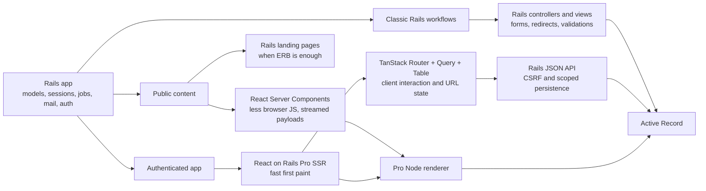

# Why RSC On Rails

React Server Components on Rails is not a claim that every Rails page should
become a React Server Component. It is a claim that a Rails application should
be able to choose modern React where it is useful without moving the app out of
Rails.

That distinction matters. Rails teams in 2026 are usually not deciding between
"server-rendered Rails" and "React" in the abstract. They already have a Rails
app with Active Record models, sessions, mailers, background jobs, admin
workflows, validations, deployment scripts, and years of product behavior. The
real question is whether they can add modern React capabilities such as React
Server Components, streaming, type-safe routing, URL-owned table state, and
client-side interactivity without rebuilding the rest of the application around
a JavaScript server framework.

There are three honest answers.

The first answer is to stay on classic Rails views plus small React mounts. That
is still a good choice for many applications. The server stays simple, Rails
keeps owning forms and redirects, and the team avoids a second rendering model.
The cost is that RSC, streaming component trees, and richer React routing are
mostly outside the architecture.

The second answer is to move the React surface to Next.js. That is also a good
choice for some teams, especially greenfield teams with a JavaScript-first
server model or no Rails-shaped domain layer to preserve. The cost is that the
Rails app stops being the center of gravity. You now have two server runtimes,
two routing systems, and a boundary between the React server and the Rails
systems that already know about data, jobs, sessions, permissions, and email.

The third answer is React on Rails Pro: keep Rails as the application server and
let the Pro Node renderer host the modern React rendering paths that need Node.
That is what this starter is exploring.

## Related React On Rails Docs

- [React on Rails Pro](https://reactonrails.com/docs/pro/) for the Pro feature
  map: Node renderer, RSC, streaming SSR, and fragment caching.
- [React Server Components in React on Rails Pro](https://reactonrails.com/docs/pro/react-server-components/)
  for the RSC overview, requirements, and tutorial route map.
- [React Server Components rendering flow](https://reactonrails.com/docs/pro/react-server-components/rendering-flow/)
  for the three-bundle flow behind the starter's RSC routes.
- [Streaming SSR](https://reactonrails.com/docs/pro/streaming-ssr/) for the
  progressive rendering model that RSC builds on.
- [Rspack compatibility](https://reactonrails.com/docs/pro/react-server-components/rspack-compatibility/)
  for why this starter keeps Rspack as the default bundler.
- [Render-functions and `railsContext`](https://reactonrails.com/docs/core-concepts/render-functions-and-railscontext/)
  for the Rails request context shared with React render functions.

## Surface-Aware Rendering Diagram



## What RSC Buys You

RSC helps when the page has meaningful server-rendered content and the browser
does not need to download the component code that produced that content.

For content-heavy public pages, server components can reduce the JavaScript sent
to the browser. A server component renders on the server; only client component
boundaries need browser JavaScript. In this starter, `/rsc-showcase` is the
public RSC + TanStack centerpiece: a bare TanStack Router loader selects a React
on Rails Pro server component and props, then the exported `RSCRoute` helper
fetches and composes that server-streamed tree beside ordinary client React.
`/hello_server` remains the lower-level streaming reference, with the Rails entrypoint in
`app/controllers/hello_server_controller.rb`, the streaming view in
`app/views/hello_server/index.html.erb`, and the component source under
`app/javascript/src/HelloServer/`.

RSC also gives you a streamed component protocol rather than a JSON props
payload that the browser must turn into the whole page. That matters for cold
loads and indexable public content. The server can start sending useful HTML
while slower server work continues. Data access can happen where the data
already lives, without first designing a browser-facing JSON endpoint for every
piece of component-level data.

Server components also give you a sharper security boundary. Queries, service
tokens, and server-only libraries can stay on the server side of the component
tree. The client receives the rendered result and the references needed to
hydrate client islands, not the server component implementation.

These benefits are not universal. An authenticated dashboard often gets less
from RSC. It is not SEO-driven, users commonly keep the JavaScript cached, and
the page value usually comes from fast interaction, URL state, optimistic
updates, charts, forms, and table behavior. For those surfaces, classic React on
Rails Pro SSR plus TanStack Router, Query, and Table can be the better fit. That
is why this starter uses the authenticated `/dashboard` and `/projects...`
routes for the TanStack shell instead of forcing the dashboard into the RSC
model.

## Why Inertia Cannot Be RSC

Inertia and RSC solve different problems.

Inertia is a JSON-over-the-wire page protocol. The server picks a page
component, serializes props, and the browser renders that page in the client
application. That model is intentionally close to classic server routing: Rails
controllers still return pages, but the view payload is a component name and
props rather than ERB.

RSC is a streamed component tree with server component and client component
boundaries. The server is not just sending props for the browser to render. It
is rendering part of the component tree itself and sending a protocol that tells
React how to combine server-rendered output with client islands.

That is an architectural mismatch, not a missing checkbox. Inertia is a useful
fit when you want Rails controllers, a client-rendered React app, and a simple
page-props contract. It is not designed to host a streamed RSC tree. This is not
a criticism of Inertia; it is a consequence of choosing a different rendering
model. The shorter comparison lives in [React on Rails + TanStack vs
Inertia](02-vs-inertia.md).

## Why Next.js Means Leaving Rails

Next.js can run RSC because it owns the JavaScript server. That is exactly the
tradeoff.

If a team moves a Rails product surface to Next.js, the React server is no
longer Rails. The app may still call Rails APIs, but each application concern
Rails already owned now needs a replacement on the JavaScript side:

- **Data layer.** Active Record gives way to a Node ORM such as Prisma or
  Drizzle, and the models, validations, scopes, and associations migrate with
  it.
- **Background jobs.** Solid Queue, Sidekiq, or GoodJob give way to a Node job
  runner such as BullMQ or Inngest.
- **Mailers.** Action Mailer rendering, previews, and delivery hooks get
  rebuilt against a JavaScript mail stack.
- **Sessions and auth.** Devise or Rails 8's generated authentication gives way
  to a Node auth library such as Auth.js or Lucia, including signup,
  verification, password reset, and session rotation.
- **Admin tooling.** ActiveAdmin, Avo, or Trestle become custom React pages, or
  you keep a Rails app running just for them and now operate two runtimes.

Around those pieces sit the cross-cutting concerns Rails also handled:
authorization boundaries, cache behavior, error handling, deployment, and
observability. Over time the team either duplicates these Rails concepts in the
JavaScript server or turns Rails into an API service behind the React app.

That can be correct. A greenfield product with a JavaScript-first team may
prefer that trade. A product whose data model does not look like Rails may not
benefit from keeping Rails at the center. A team already standardized on
Next.js may reasonably choose the framework that matches its operations.

The point of this starter is narrower: if the application is already a Rails
application, "use RSC" should not automatically mean "move the application
server to Next.js."

## Surface-Aware Rendering

The practical answer is not one rendering model. It is surface-aware rendering.

Public content is where RSC and streaming are most compelling. A landing page,
documentation page, pricing page, product catalog page, or content page can
benefit from server-only data access, streamable HTML, and less client
JavaScript. In this starter today, `/rsc-showcase` is the RSC route that makes
that positioning visible inside a TanStack Router surface. The root path `/`
stays a Rails landing page that links into the examples and explains the
rendering choices.

Authenticated app surfaces are different. The dashboard in
`app/javascript/src/Dashboard/ror_components/DashboardApp.tsx` is prerendered
through React on Rails Pro, then hydrated into a TanStack Router app. Rails
continues to own authentication, CSRF, JSON endpoints, model validation, and
record scoping. TanStack owns nested routes, query caching, URL search state,
mutations, and table rendering once the shell is loaded.

Classic Rails views still have a place. `/classic/projects` remains a
server-rendered CRUD surface for the same project model. That route is not a
fallback for failed React. It is a deliberate coexistence example: Rails forms,
server-side validations, and incremental React can live beside a richer
TanStack surface.

The rendering-mode drawer in the dashboard is the product explanation of this
same architecture. Its source is `RenderingModeDrawer` in
`app/javascript/src/Dashboard/ror_components/DashboardApp.tsx`.


## How Pro Makes It Work

React on Rails Pro provides the Node renderer that makes modern React rendering
available without moving the Rails application server out of Rails. The renderer
entrypoint is `client/node-renderer.js`; Rails points at it through
`config/initializers/react_on_rails_pro.rb`.

That split is the core integration. Rails still owns the request, the route,
the session, the current user, the CSRF token, and the initial props. The Node
renderer handles the React rendering work that needs a JavaScript runtime. The
same app can use:

- RSC streaming through `stream_react_component` on the `/hello_server` route.
- RSC-as-data composition through the `/rsc-showcase` TanStack Router loader.
- React on Rails Pro prerendering for the authenticated `DashboardApp`.
- TanStack Router SSR state handoff through the Pro TanStack integration.
- TanStack Query requests back to Rails through the CSRF-aware `apiFetch`
  helper.
- TanStack Table state backed by Rails filtering, sorting, and pagination.
- Classic Rails controllers and views under `/classic/projects`.

That is why this repo is intentionally hybrid. It is not trying to replace Rails
with a React framework. It is trying to show where each rendering surface fits
inside one Rails app.

## Limitations And Current State

This starter intentionally keeps Rspack as the local and deploy default.
`react-on-rails-rsc@19.2.1-rc.0` provides the Rspack plugin path that emits the
RSC client-reference manifests required by React on Rails Pro. That status is
tracked in [SPIKE.md](../SPIKE.md), and the small reproduction remains available
through `pnpm run repro:rspack-rsc`.

The Webpack bridge is still documented and available as an opt-in comparison
path, but `/rsc-showcase` now works on the default Rspack path. The checked
smoke coverage in [Tested Modes](06-tested-modes.md)
keeps both bundler paths visible so neither silently regresses.

This is also why the thesis here is framed as surface-aware rendering rather
than "make every page RSC." React's RSC APIs are stable enough to build on, but
framework and bundler integration still matters. Rails teams should be able to
adopt the parts that are ready for their surfaces while keeping the rest of the
application on proven Rails and React on Rails rendering paths.

## What This Kit Is Not

This kit is not Next.js. It does not try to make Rails look like a JavaScript
server framework.

It is not Inertia. It does not bet on a JSON props protocol as the only bridge
between Rails and React.

It is also not a recommendation that every Rails app needs RSC, client-side
routing, or TanStack Table. If your app is mostly forms, redirects, and
server-rendered pages, classic Rails may be the best answer. If your team wants
client-rendered React pages from Rails controllers and does not need RSC,
Inertia may be a simpler answer. If your team is greenfield and wants a
JavaScript server to own the app, Next.js may be the better answer.

This starter is for Rails teams that want modern React options without turning
the Rails app into a backend-only service.

## Try It

Run the starter locally:

```sh
bin/setup
bin/dev
```

Use `demo@example.com / password` to sign in. Visit `/dashboard` for the
authenticated overview, `/projects` for the focused TanStack Table and project
routes, `/classic/projects` for the Rails CRUD surface, `/rsc-showcase` for the
RSC + TanStack route on Rspack, and `/hello_server` for the lower-level RSC
streaming demo.

The launch deployment target is `https://starter.reactonrails.com`. After the
deployment issue is complete, the same demo user should work there.

Use this repo as the template source:
[shakacode/react-on-rails-starter-tanstack](https://github.com/shakacode/react-on-rails-starter-tanstack).

React on Rails Pro is the integration point for the Node renderer, TanStack SSR,
and RSC path. See [React on Rails Pro](https://reactonrails.com/pro/) for the
commercial package details.
