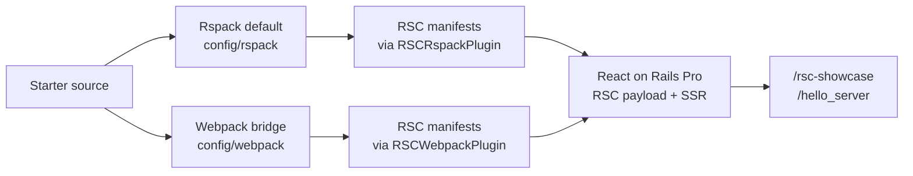

# RSC Webpack Bundler Spike

> Status update: this is now historical bridge documentation.
> `react-on-rails-rsc@19.0.5-rc.3` adds `RSCRspackPlugin`, and the default
> Rspack build now emits both RSC client-reference manifests. Webpack remains
> wired as an opt-in bridge/comparison path, so this file records the bridge
> evidence and comparison path.

## Related React On Rails Docs

- [Rspack compatibility with React Server Components](https://reactonrails.com/docs/pro/react-server-components/rspack-compatibility/)
  for the current default Rspack status.
- [React Server Components rendering flow](https://reactonrails.com/docs/pro/react-server-components/rendering-flow/)
  for the client/server/RSC bundle responsibilities.
- [Flight protocol syntax](https://reactonrails.com/docs/pro/react-server-components/flight-protocol-syntax/)
  for the payload format that the manifests support.
- [React on Rails Pro troubleshooting](https://reactonrails.com/docs/pro/troubleshooting/)
  for RSC manifest and hydration failures.

## Bundler Comparison Diagram



## Question

Before native Rspack support, did switching the Shakapacker bundler from
**Rspack to Webpack** make interactive React Server Components work in this
starter — i.e. did the Webpack build emit the RSC client-reference manifests
that the old Rspack build did not?

- `public/packs/react-client-manifest.json`
- `ssr-generated/react-server-client-manifest.json`

(See `SPIKE.md` for the current Rspack/RSC status and the historical upstream
tracking in shakacode/react_on_rails#1828 / #3385.)

## Verdict: YES

On Webpack the build emits **both** RSC client-reference manifests, the React on
Rails Pro Node renderer loads them, `/hello_server` (the `use client`
`LikeButton` island) renders end-to-end with `REQUIRE_RSC_MANIFESTS=true`, and
`/rsc-showcase` can fetch and compose a Pro RSC payload inside a bare TanStack
Router route loader.

### Evidence

Full production build on Webpack (`SHAKAPACKER_ASSETS_BUNDLER=webpack`):

```text
public/packs/react-client-manifest.json        (2.2 KB)  ✅
ssr-generated/react-server-client-manifest.json (1.0 KB)  ✅
ssr-generated/server-bundle.js                 (3.9 MB)  ✅
ssr-generated/rsc-bundle.js                    (269 KB)  ✅
```

Both manifests contain the `LikeButton` client reference, e.g. the client
manifest:

```json
".../HelloServer/components/LikeButton.tsx": {
  "id": 3591, "chunks": [1719, "js/client1-….chunk.js"], "name": "*"
}
```

- `pnpm run repro:rspack-rsc` with `SHAKAPACKER_ASSETS_BUNDLER=webpack
  REQUIRE_RSC_MANIFESTS=true` → `"status": "ready"`, both manifests present,
  exit 0. (Before `react-on-rails-rsc@19.0.5-rc.3`, the same gate failed on
  Rspack.)
- `SHAKAPACKER_ASSETS_BUNDLER=webpack REQUIRE_RSC_MANIFESTS=true node
  script/dev-mode-smoke.mjs static hello-server` → full stack boots; the Node
  renderer logs `Copied assets ["react-client-manifest.json",
  "react-server-client-manifest.json"]`; `/hello_server` returns HTTP 200 with
  `"missingRscManifests": []`, `"outcome": "rendered"`.
- `SHAKAPACKER_ASSETS_BUNDLER=webpack REQUIRE_RSC_MANIFESTS=true node
  script/dev-mode-smoke.mjs hmr hello-server` → Webpack dev-server + HMR boots,
  writes the client manifest to disk for Pro, and `/hello_server` streams the
  RSC view instead of rendering the fallback.
- `SHAKAPACKER_ASSETS_BUNDLER=webpack pnpm exec playwright test
  test/playwright/rsc_showcase.spec.ts` → `/rsc-showcase` fetches the Pro RSC
  payload through its TanStack Router loader, renders the RSC island, and keeps
  the route-owned client island interactive.
- The Rspack track has since changed: with `react-on-rails-rsc@19.0.5-rc.3`,
  the default-bundler repro reports `"status": "ready"` with both manifests
  present.

## Why Webpack was needed before `react-on-rails-rsc@19.0.5-rc.3`

Before `react-on-rails-rsc@19.0.5-rc.3`, `RSCWebpackPlugin` was hard-wired to
Webpack internals
(`require('webpack/lib/dependencies/ModuleDependency')`,
`require('webpack/lib/Template')`, etc.). Rspack does not expose those modules,
so the old `config/rspack/*` configs deliberately skipped the plugin on Rspack,
which is exactly why the Rspack build could not emit the manifests. On Webpack
the plugin runs:

- `RSCWebpackPlugin({ isServer: false })` on the client → `react-client-manifest.json`
- `RSCWebpackPlugin({ isServer: true })` on the server → `react-server-client-manifest.json`
- `react-on-rails-rsc/WebpackLoader` on the RSC bundle → strips client components.

## Configuration required

A new `config/webpack/` directory mirrors `config/rspack/` (client + server +
RSC + env dispatchers). Shakapacker auto-discovers `config/webpack/webpack.config.js`
when the active bundler is `webpack`. Rspack stays the committed default; Webpack
is opt-in and env-selectable:

```sh
# one-off build / run on Webpack, leaving config/shakapacker.yml on rspack
SHAKAPACKER_ASSETS_BUNDLER=webpack bin/shakapacker
bin/shakapacker --bundler webpack
```

Three non-obvious adjustments were needed beyond a straight port of the Pro
`spec/dummy` Webpack config, all caused by TanStack packages shipping dual
`src`/`dist` output with `use client` directives:

1. **`resolve.conditionNames`** pinned to the standard set
   (`['require','node','import','module','default','...']`). Without it Webpack's
   resolver falls through to the first `exports` key, and some `@tanstack/*-devtools`
   packages list a non-standard `@tanstack/custom-condition` first that points at
   raw `src/*.ts` → "Module parse failed".
2. **A scoped `swc-loader` rule** for `@tanstack` source TS that leaks into the
   RSC client-reference graph (Shakapacker's default JS rule excludes
   `node_modules`).
3. **Per-call rule construction + an RSC-loader skip for the `@tanstack` rule.**
   The RSC config appends `react-on-rails-rsc/WebpackLoader` to any swc/babel
   rule; sharing a single rule object across the client/server/RSC builds (one
   Webpack invocation) leaked the RSC transform into the client/server bundles,
   producing duplicate `export const type` / `export const interface` proxies
   from TanStack's TS type exports. This is the third-party-package form of the
   known RSC pitfall ("a `use client` module must export only its component, not
   TS types"). `config/webpack/rscWebpackConfig.js` skips the `@tanstack` rule so
   only type-stripping (not the RSC transform) runs on those files.

Rspack does not surface any of these because it doesn't run the Webpack RSC
plugin/loader and resolves the TanStack `exports` maps without the fall-through.
With `RSCRspackPlugin`, Rspack now has its own manifest-generation path.

## Tradeoffs vs Rspack

| Dimension            | Rspack (default)         | Webpack (RSC-capable)               |
| -------------------- | ------------------------ | ----------------------------------- |
| Interactive RSC      | ✅ manifests emitted with `react-on-rails-rsc@19.2.1` | ✅ manifests emitted, island renders |
| Clean prod build     | ~2.8 s                   | ~8.3 s (≈3× slower)                 |
| Client JS total      | ~2.6 MB                  | ~2.6 MB (comparable)                |
| Dev server / HMR     | `@rspack/plugin-react-refresh` | `@pmmmwh/react-refresh-webpack-plugin`; dashboard and `/hello_server` HMR smokes pass |
| Extra deps           | —                        | `webpack`, `webpack-cli`, `webpack-dev-server`, `webpack-assets-manifest`, `@pmmmwh/react-refresh-webpack-plugin` |

Build time is the main regression (~3×). Bundle size is comparable. Webpack dev
server / HMR is now covered by targeted bridge smokes; Rspack remains the local
default.

## Caveats / follow-ups

- The TanStack `src`-leak workarounds are specific to this app's Webpack
  dependency set. Rspack no longer needs the Webpack bridge for manifest
  generation.
- `pnpm-workspace.yaml` gained `'core-js-pure': false` (a transitive dep of the
  new Webpack/react-refresh tree whose only postinstall is a funding message).

---

# Adoption: full-app verification + deploy wiring

The section above is the original spike (proving Webpack emits the manifests and
`/hello_server` renders). This section de-risks turning Webpack on for the
**deployed** demo: it verifies every surface on Webpack, wires the Docker build
to use it, and records the one remaining (out-of-scope) blocker for interactive
RSC under the production CSP.

## A required fix beyond the spike: SWC JSX runtime (`config/swc.config.js`)

The spike verified `/hello_server` and the manifests, but a **full**-app build on
Webpack 500s on every prerendered TanStack route (e.g. `/dashboard`) with:

```text
ReferenceError: React is not defined
    at Toaster (app/javascript/src/components/ui/sonner.tsx)
```

Root cause: Shakapacker's default `swc-loader` config (used by the Webpack
bundler path, `shakapacker/package/swc`) does **not** set
`jsc.transform.react.runtime`, so SWC falls back to the *classic* JSX runtime
(`React.createElement`). App source that uses JSX without `import React`
(e.g. `sonner.tsx`) then throws at SSR. The Rspack path never hits this because
Shakapacker's Rspack rules hardcode `react.runtime: "automatic"` in their
`builtin:swc-loader` (`shakapacker/package/rules/rspack.js`).

Fix: a project-level `config/swc.config.js` that sets
`jsc.transform.react.runtime = 'automatic'`. Shakapacker merges it into the
default swc-loader config for the Webpack path. It is **inert on Rspack** (Rspack
uses `builtin:swc-loader` and never reads this file), so it is safe to keep
regardless of the active bundler. This brings the Webpack build to JSX-runtime
parity with Rspack and is required for Webpack adoption.

## Full-app verification on Webpack (commands + outcomes)

All run with `SHAKAPACKER_ASSETS_BUNDLER=webpack` on a clean production build
(`bin/shakapacker-precompile-hook` + `RAILS_ENV=production bin/rails assets:precompile`).

| Surface | How verified | Outcome |
| --- | --- | --- |
| Production Webpack build | `RAILS_ENV=production assets:precompile` | ✅ client + server + RSC bundles, both RSC manifests emitted, 0 dev-runtime client chunks |
| `/` landing | `curl` prod server + root/a11y/CSP coverage | ✅ HTTP 200, public RSC + TanStack positioning renders |
| `/dashboard`, `/settings`, `/projects/new` (TanStack SSR) | `node script/dev-mode-smoke.mjs static dashboard` | ✅ smoke passed: SSR shell + single-document hydration contract, settings nav, new-project route |
| Classic Rails CRUD (`/classic/projects` index/new/show) | authed `curl` on prod server | ✅ HTTP 200 on all three |
| Auth (sign-in, signup, reset, verify) | dashboard smoke + `auth.spec.ts` | ✅ sign-in POST → 302 `/`; all auth Playwright specs pass |
| `/hello_server` interactive RSC | `REQUIRE_RSC_MANIFESTS=true node script/dev-mode-smoke.mjs static hello-server` | ✅ `"missingRscManifests": []`, `"outcome": "rendered"` |
| `/rsc-showcase` RSC-in-TanStack route | `pnpm exec playwright test test/playwright/rsc_showcase.spec.ts` | ✅ loader selected the Pro RSC component/props, `RSCRoute` fetched and rendered the payload, and both the RSC island and route-owned client island stayed interactive |
| Webpack HMR dashboard | `SHAKAPACKER_ASSETS_BUNDLER=webpack node script/dev-mode-smoke.mjs hmr dashboard` | ✅ Webpack dev-server starts with HMR, dashboard hydrates/navigates, and the browser observes a source edit via hot-update assets |
| Webpack HMR `/hello_server` RSC | `SHAKAPACKER_ASSETS_BUNDLER=webpack REQUIRE_RSC_MANIFESTS=true node script/dev-mode-smoke.mjs hmr hello-server` | ✅ both RSC manifests present, `/hello_server` streams the RSC view instead of the fallback |
| LikeButton client island hydration | Playwright click (CSP bypassed) | ✅ `0 likes` → `1 like` — island hydrates and is interactive |
| RSpec | `SHAKAPACKER_ASSETS_BUNDLER=webpack bundle exec rspec` | ✅ request coverage passed |
| Playwright (full) | `SHAKAPACKER_ASSETS_BUNDLER=webpack pnpm exec playwright test` | ✅ landing, auth, dashboard, route matrix, CSP, a11y |
| Production boot (true `RAILS_ENV=production` server + Node renderer) | `node script/production-boot-smoke.mjs` | ✅ "Production boot smoke passed" |

## Optional Webpack Build Wiring

The bundler is selected at `assets:precompile` time **inside the Docker image
build** (`.controlplane/Dockerfile`), not at runtime — a Control Plane GVC env
var will NOT change it. The deployed build now defaults to `rspack`, set as an
`ENV` immediately before the precompile steps:

```dockerfile
ARG SHAKAPACKER_ASSETS_BUNDLER=rspack
ENV SHAKAPACKER_ASSETS_BUNDLER=${SHAKAPACKER_ASSETS_BUNDLER}
```

- `config/shakapacker.yml` keeps `assets_bundler: rspack` as the repo default,
  so local DX (`bin/dev`) and the deployed image both stay on Rspack.
- The webpack toolchain deps are already in the lockfile, so the Dockerfile's
  `pnpm install --frozen-lockfile` installs them with no Docker change.
- **Opting into Webpack remains one line**: build with
  `--build-arg SHAKAPACKER_ASSETS_BUNDLER=webpack`. No other change.

## Remaining hacks and whether they are load-bearing

- **`config/swc.config.js` (automatic JSX runtime)** — load-bearing for Webpack
  (without it, every prerendered TanStack route 500s). Inert on Rspack.
- **TanStack `src`-leak workarounds** (`resolve.conditionNames`, the scoped
  `@tanstack` swc rule, per-call rule objects, the RSC-loader skip in
  `rscWebpackConfig.js`) — load-bearing for Webpack with this app's TanStack deps;
  removing any of them reintroduces "Module parse failed" or invalid
  `export const type` proxies. Specific to this dependency set; the clean
  long-term fix is upstream (see Caveats). Inert on Rspack.
- **`config/devServerMode.js` + Webpack dev-server write-to-disk** —
  load-bearing for Webpack HMR. Shakapacker's JS bundler config loader reads
  `config/shakapacker.yml` without ERB evaluation, so `hmr`/`live_reload` must be
  normalized in JS. Webpack dev-server also has to persist non-hot-update assets
  so React on Rails Pro can read `react-client-manifest.json` during RSC payload
  generation.
- **`pnpm-workspace.yaml` `'core-js-pure': false`** — cosmetic (suppresses a
  funding-message postinstall); not behavioral.

## Known limitation: interactive RSC under the production CSP (out of scope)

`/hello_server`'s LikeButton hydrates and is interactive when the CSP is not
enforcing (verified above), but under the **strict production CSP**
(`script-src 'self' 'nonce-…'`) React's streaming-SSR inline bootstrap (`$RC=…`,
emitted by `react-dom/server`) is injected **without** the request's CSP nonce
and is blocked, so the island does not hydrate in the browser. This is a
**react-on-rails-pro RSC-streaming ⇄ CSP-nonce** integration issue — not a
bundler or Webpack-adoption issue:

- It is independent of Rspack vs Webpack. Rspack now emits the manifests; the
  remaining failure mode is React's nonce-less streaming bootstrap under strict
  production CSP.
- `/` and `/dashboard` have **no** CSP errors on Webpack (`csp.spec.ts` passes),
  because they use classic React on Rails Pro SSR (nonce'd scripts), not RSC
  streaming.
- `/rsc-showcase` is the safe public interim because it fetches the RSC payload
  as route data and does not depend on React's inline streaming bootstrap.
- Fix belongs upstream in react-on-rails-pro (React's streaming bootstrap must
  receive the per-request nonce). See `docs/11-rsc-csp-nonce-spike.md` for the
  reproduction, rejected in-app workarounds, and safe interim.

## Historical go / no-go for flipping the staging deploy to Webpack

**YES — safe to flip staging to Webpack.** Every deployed surface
(landing, `/rsc-showcase`, classic CRUD, auth, the TanStack dashboard SSR, and
the production boot) works on Webpack and is covered by green RSpec, Playwright,
and smoke runs; the build is reversible to Rspack in one line. The single caveat
is that `/hello_server`'s client island will not *hydrate* under the production
CSP until the upstream streaming-script-nonce fix lands — but the route still
renders (HTTP 200, SSR'd), it is strictly better than the Rspack fallback, and it
does not affect any other surface. Flip staging, use `/rsc-showcase` as the
public RSC centerpiece, and keep `/hello_server` interactivity as the known
upstream follow-up.
