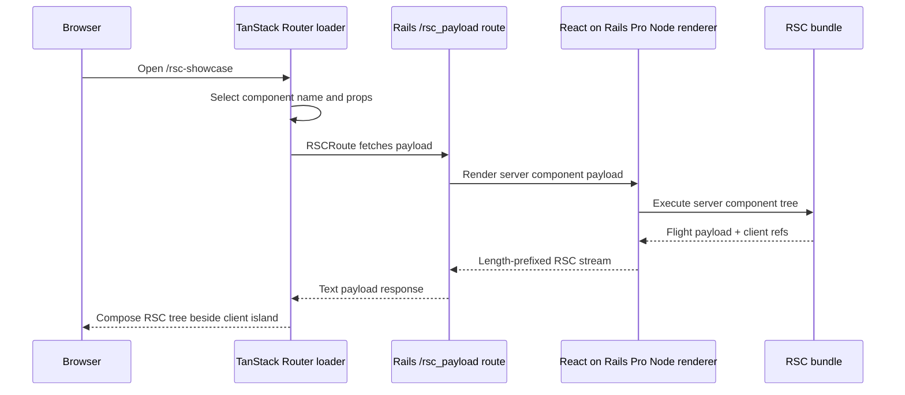

# RSC Payloads In A TanStack Route Loader

This spike verifies the default Rspack bundler can compose a React on Rails Pro
React Server Component payload inside a plain `@tanstack/react-router` route
with `react-on-rails-rsc@19.0.5-rc.3`. It does not use TanStack Start, Vite,
file-based routing, Hotwire, or Stimulus.

## Related React On Rails Docs

- [React Server Components in React on Rails Pro](https://reactonrails.com/docs/pro/react-server-components/)
  for the RSC overview and tutorial route map.
- [React Server Components rendering flow](https://reactonrails.com/docs/pro/react-server-components/rendering-flow/)
  for the client, server, and RSC bundle responsibilities.
- [Flight protocol syntax](https://reactonrails.com/docs/pro/react-server-components/flight-protocol-syntax/)
  for the wire format consumed by the Pro RSC client helpers.
- [Pro installation](https://reactonrails.com/docs/pro/installation/) for the
  `RSCRoute`, `registerServerComponent`, and wrapper imports this route uses.
- [Rspack compatibility](https://reactonrails.com/docs/pro/react-server-components/rspack-compatibility/)
  for the manifest-generation path this spike validates.
- [Pro troubleshooting](https://reactonrails.com/docs/pro/troubleshooting/) for
  common RSC payload and hydration failures.

## Payload Loader Diagram



## Result

- Rails serves the public `/rsc-showcase` page and remains responsible for the
  route, CSP, and the Pro `/rsc_payload/:component_name` endpoint.
- A TanStack Router loader selects the server component and props for
  `RscShowcaseServerPanel`.
- `RscShowcaseApp` is registered through
  `react-on-rails-pro/wrapServerComponentRenderer/client`, which installs the
  Pro RSC provider around the route tree.
- The route renders the exported `react-on-rails-pro/RSCRoute` helper, so React
  on Rails Pro owns the payload fetch, length-prefixed stream parser, and Flight
  rendering.
- The local `app/views/react_on_rails_pro/rsc_payload.text.erb` override keeps
  the helper output trim-safe so the streamed response does not add a blank line
  between length-prefixed chunks. Track removing this override against
  `shakacode/react_on_rails#3499`.
- The fetched RSC tree renders beside ordinary route-level client React.
- A `use client` island inside the fetched RSC payload hydrates and updates
  independently from the route-owned client panel.

Verified locally on Rspack with:

```sh
bin/shakapacker
RENDERER_HOST=127.0.0.1 RENDERER_PORT=3402 node client/node-renderer.js
SKIP_DATABASE_CHECK=true RAILS_ENV=development PORT=3400 \
  REACT_RENDERER_URL=http://127.0.0.1:3402 \
  bin/rails server -p 3400
```

Browser verification against `http://127.0.0.1:3400/rsc-showcase` confirmed:

- the route rendered the RSC payload through `RSCRoute`;
- the server component rendered in the TanStack route;
- the RSC-embedded client island accepted clicks;
- the route-owned client island accepted clicks.

## Rspack Default Behavior

Rspack remains the default in `config/shakapacker.yml` and the deploy image.
`react-on-rails-rsc@19.0.5-rc.3` emits the RSC client-reference manifests on
Rspack, so `/rsc-showcase` fetches the payload on the default path. The route
still checks manifest availability before rendering `RSCRoute`, so it can render
an honest fallback if a future dependency regression removes the manifests.

## Follow-Up For Issue #110

This proves the core composition contract for the public centerpiece route:

> React on Rails Pro composes server-streamed RSC into a TanStack route on
> Rails; this is not TanStack Start parity.

The current route is intentionally client-composed: the TanStack loader owns the
route data, and `RSCRoute` owns the RSC payload fetch/render lifecycle. A future
SSR-preloaded version would need a Pro helper that exposes the same server-side
preload behavior for a bare TanStack route without requiring TanStack Start.
