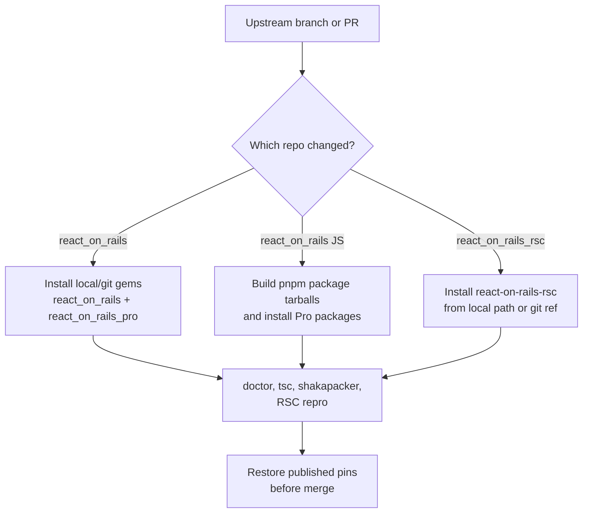

# Testing Upstream Branches

Use this workflow when validating unreleased changes from:

- `shakacode/react_on_rails`
- `shakacode/react_on_rails_rsc`

Keep published versions on `main`. Use upstream branches only on temporary
validation branches unless the PR is explicitly a canary PR.

## Ground Rules

- Start from a starter feature branch.
- Prefer local clones for fast iteration.
- Do not merge `file:` or absolute path dependencies to `main`.
- Replace branch/path dependencies with published gem and npm versions before a
  release PR merges.
- Re-run both Ruby and JavaScript installs after changing dependency sources.
- Keep `react-on-rails-pro` as the only direct React on Rails JavaScript package
  in `package.json`; Pro depends on the base `react-on-rails` package.

## Related React On Rails Docs

- [Upgrading React on Rails Pro](https://reactonrails.com/docs/pro/updating/)
  for published package changes and version alignment.
- [React on Rails Pro installation](https://reactonrails.com/docs/pro/installation/)
  for the expected gem/npm package layout.
- [React Server Components in React on Rails Pro](https://reactonrails.com/docs/pro/react-server-components/)
  for the RSC package and manifest expectations under test.
- [Rspack compatibility](https://reactonrails.com/docs/pro/react-server-components/rspack-compatibility/)
  for the default native Rspack path.

## Upstream Validation Diagram



## Local Clones

The examples below assume sibling clones:

```sh
git clone git@github.com:shakacode/react_on_rails.git ../react_on_rails
git clone git@github.com:shakacode/react_on_rails_rsc.git ../react_on_rails_rsc
```

Switch each clone to the branch under test:

```sh
git -C ../react_on_rails switch main
git -C ../react_on_rails pull --ff-only

git -C ../react_on_rails_rsc switch main
git -C ../react_on_rails_rsc pull --ff-only
```

Replace `main` with the branch name when validating a PR branch.

## Ruby Gems From `react_on_rails`

For local source validation, temporarily edit the starter `Gemfile`:

```ruby
gem "react_on_rails", path: "../react_on_rails/react_on_rails"
gem "react_on_rails_pro", path: "../react_on_rails/react_on_rails_pro"
```

Then run:

```sh
bundle install
```

To test a remote branch without a local clone, use git sources instead:

```ruby
gem "react_on_rails",
    git: "https://github.com/shakacode/react_on_rails.git",
    branch: "main",
    glob: "react_on_rails/react_on_rails.gemspec"

gem "react_on_rails_pro",
    git: "https://github.com/shakacode/react_on_rails.git",
    branch: "main",
    glob: "react_on_rails_pro/react_on_rails_pro.gemspec"
```

## JavaScript Packages From `react_on_rails`

The React on Rails JavaScript packages live in a pnpm workspace. For branch
testing, build package tarballs from the upstream clone instead of pointing the
starter at the repository root.

```sh
cd ../react_on_rails
pnpm install
pnpm run build
mkdir -p /tmp/react-on-rails-packs
pnpm --filter react-on-rails pack --pack-destination /tmp/react-on-rails-packs
pnpm --filter react-on-rails-pro pack --pack-destination /tmp/react-on-rails-packs
pnpm --filter react-on-rails-pro-node-renderer pack --pack-destination /tmp/react-on-rails-packs
```

Back in the starter, install the Pro package tarballs and override the transitive
base package to the matching tarball:

```sh
pnpm add \
  /tmp/react-on-rails-packs/react-on-rails-pro-*.tgz \
  /tmp/react-on-rails-packs/react-on-rails-pro-node-renderer-*.tgz
```

Then temporarily add or update the existing `overrides` block in
`pnpm-workspace.yaml`:

```yaml
overrides:
  react-on-rails: "file:/tmp/react-on-rails-packs/react-on-rails-<version>.tgz"
```

Use the actual tarball name generated by `pnpm pack`. Run:

```sh
pnpm install
```

Do not add `react-on-rails` as a direct dependency in `package.json`; the 17 RC
doctor treats direct `react-on-rails` plus `react-on-rails-pro` as a conflict.

## `react-on-rails-rsc` From `react_on_rails_rsc`

For local source validation:

```sh
cd ../react_on_rails_rsc
yarn install
yarn run build

cd ../react-on-rails-starter-tanstack
pnpm add react-on-rails-rsc@file:../react_on_rails_rsc
```

To test a remote branch directly:

```sh
pnpm add react-on-rails-rsc@git+ssh://git@github.com/shakacode/react_on_rails_rsc.git#main
```

Replace `main` with the branch name when validating a PR branch.

## Verification

After swapping any upstream source, run the narrow checks first:

```sh
bundle exec rails react_on_rails:doctor
pnpm exec tsc --noEmit
bin/shakapacker
SHAKAPACKER_ASSETS_BUNDLER=webpack bin/shakapacker
pnpm run repro:rspack-rsc
```

When testing native Rspack RSC support, require manifests explicitly:

```sh
REQUIRE_RSC_MANIFESTS=true pnpm run repro:rspack-rsc
```

For a release-impacting branch, also run:

```sh
bin/test smoke
bin/test quality
bin/test security
bin/test production-precompile
```

## Returning To Published Packages

Before merging a release PR, restore published dependency pins:

```sh
git restore Gemfile Gemfile.lock package.json pnpm-lock.yaml pnpm-workspace.yaml
bundle install
pnpm install
```

Then apply the intended published versions with `bundle update` and `pnpm add`.
Run the verification commands again against the published artifacts.
