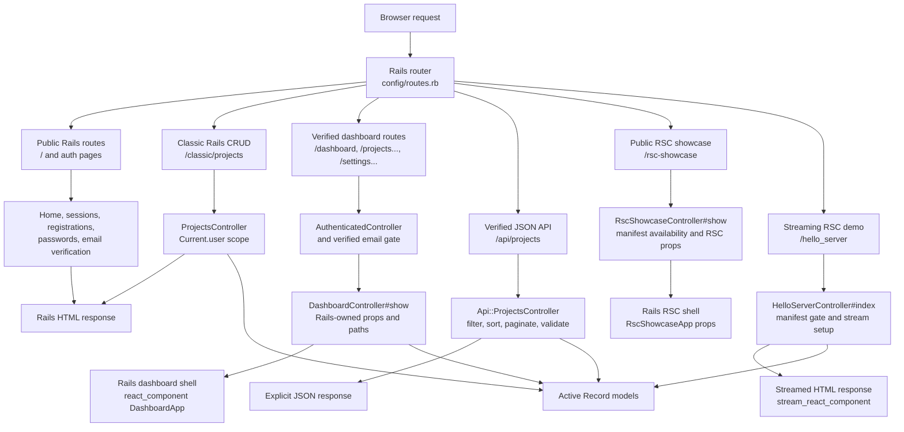
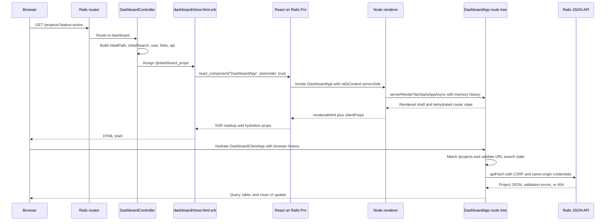
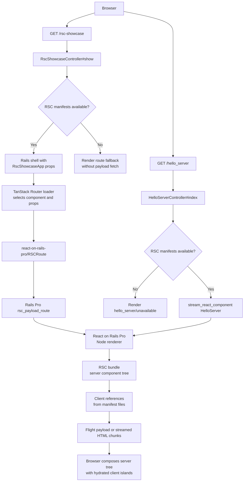
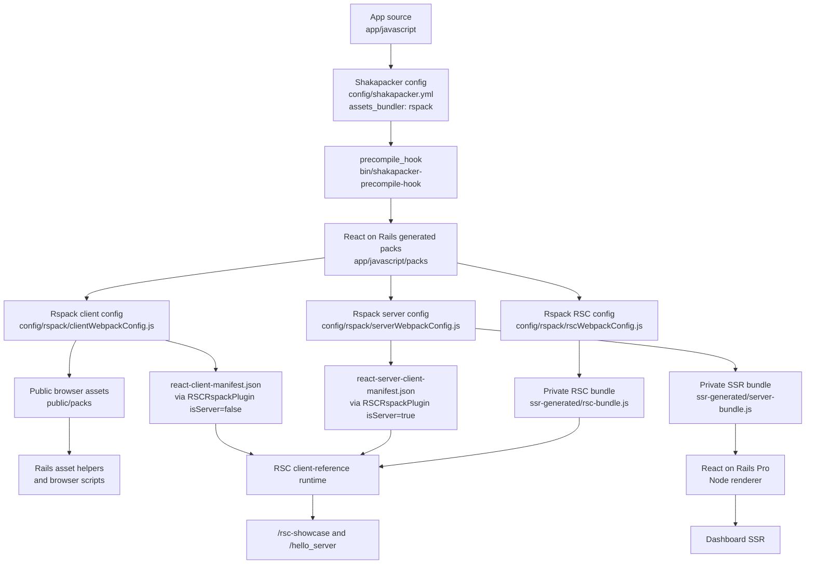

# Architecture Flow Diagrams

These diagrams show the runtime handoffs that sit behind the shorter ownership
diagram in [Architecture](01-architecture.md). They are implementation maps, not
new architecture promises. When a diagram and code disagree, treat the linked
source files as the source of truth.

## Rails Request Flow

Rails remains the application server. It owns request routing, auth gates,
session state, CSRF, controllers, Active Record access, and the HTML or JSON
response boundary for every surface.

Implementation anchors:

- [`config/routes.rb`](../config/routes.rb) maps every public, authenticated,
  API, classic Rails, and RSC route.
- [`app/controllers/dashboard_controller.rb`](../app/controllers/dashboard_controller.rb)
  passes Rails-owned paths, current user data, API links, and build metadata to
  the authenticated TanStack shell.
- [`app/controllers/api/projects_controller.rb`](../app/controllers/api/projects_controller.rb)
  keeps filtering, sorting, pagination, validation, and per-user scoping on the
  Rails side.

## TanStack Full-Page Route Flow

The authenticated dashboard is still entered through Rails routes. React on
Rails Pro prerenders the TanStack Router tree on the server, then the browser
hydrates the same route tree and keeps route/search state client-side.

Implementation anchors:

- [`app/views/dashboard/show.html.erb`](../app/views/dashboard/show.html.erb)
  renders `DashboardApp` with React on Rails Pro prerendering outside test.
- [`app/javascript/src/Dashboard/ror_components/DashboardApp.tsx`](../app/javascript/src/Dashboard/ror_components/DashboardApp.tsx)
  defines the TanStack route tree, server rendering branch, browser hydration
  branch, query client provider, route/search validation, and project table UI.
- [`app/javascript/lib/apiFetch.ts`](../app/javascript/lib/apiFetch.ts) keeps
  Rails CSRF and same-origin credentials attached to dashboard JSON requests.

## RSC Rendering Flow

The starter has two RSC routes. `/rsc-showcase` composes an RSC payload inside a
bare TanStack Router route through `RSCRoute`. `/hello_server` demonstrates the
lower-level streaming helper. Both rely on the RSC client-reference manifests
emitted by the active Shakapacker bundler.

Implementation anchors:

- [`app/javascript/src/RscShowcase/ror_components/RscShowcaseApp.tsx`](../app/javascript/src/RscShowcase/ror_components/RscShowcaseApp.tsx)
  wraps the public route with
  `react-on-rails-pro/wrapServerComponentRenderer/client`, selects the RSC
  component in a TanStack loader, and renders the exported `RSCRoute` helper.
- [`app/views/hello_server/index.html.erb`](../app/views/hello_server/index.html.erb)
  calls `stream_react_component("HelloServer", props: @hello_server_props)`.
- [`app/javascript/src/HelloServer/components/HelloServer.tsx`](../app/javascript/src/HelloServer/components/HelloServer.tsx)
  is the async server component that includes a `LikeButton` client island.
- [`app/views/react_on_rails_pro/rsc_payload.text.erb`](../app/views/react_on_rails_pro/rsc_payload.text.erb)
  keeps the Pro payload response trim-safe for the current length-prefixed
  stream parser.

## Rspack And Shakapacker Asset Flow

Rspack is the default Shakapacker bundler. The same Shakapacker entrypoints
build public client assets, the private server bundle used by the Pro Node
renderer, and the RSC bundle used for server component payloads.

Implementation anchors:

- [`config/shakapacker.yml`](../config/shakapacker.yml) selects `rspack`,
  defines public and private output paths, and wires the precompile hook.
- [`config/rspack/clientWebpackConfig.js`](../config/rspack/clientWebpackConfig.js)
  builds public client assets and emits the client RSC manifest.
- [`config/rspack/serverWebpackConfig.js`](../config/rspack/serverWebpackConfig.js)
  builds the private `server-bundle.js` for the Pro Node renderer and emits the
  server-side client-reference manifest.
- [`config/rspack/rscWebpackConfig.js`](../config/rspack/rscWebpackConfig.js)
  builds the private `rsc-bundle.js` with the RSC loader and `react-server`
  condition.
- [`docs/06-tested-modes.md`](06-tested-modes.md) records which smoke tiers
  cover live reload, static assets, production-like assets, HMR, production
  boot, and the Rspack/RSC repro.
